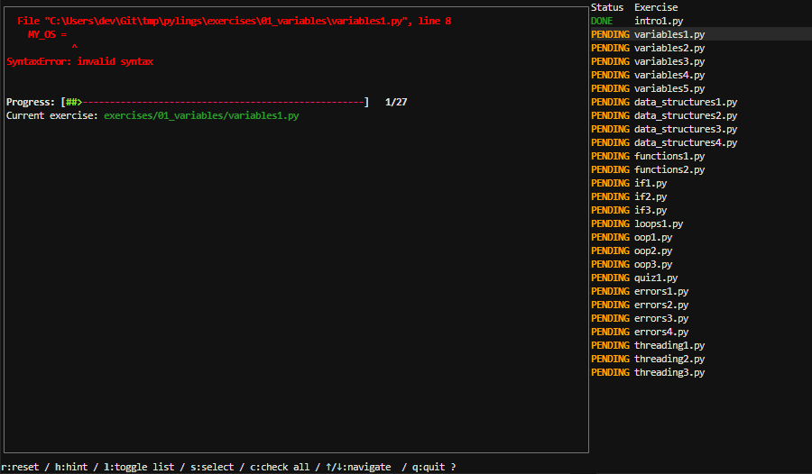
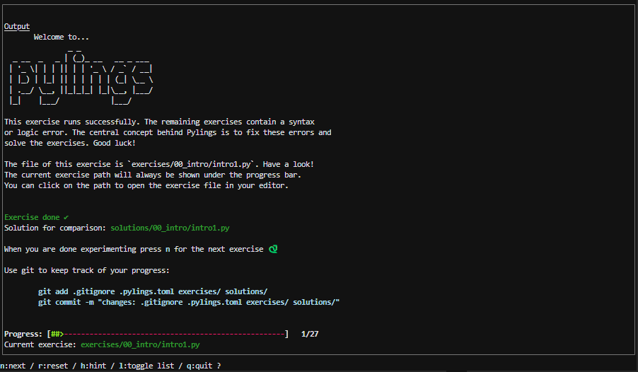
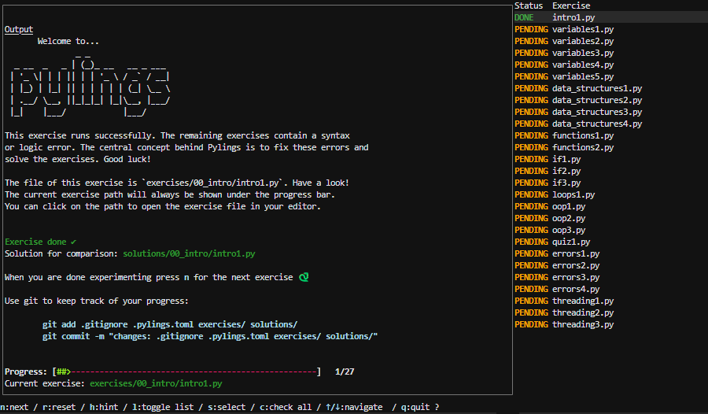

<div align="center">
	<h1 align="center"><b>Pylings</b></h1>
</div>

<br/>


## Purpose

Pylings is an interactive Python learning tool heavily inspired by the renowned [Rustlings](https://github.com/rust-lang/rustlings). It provides small, focused exercises to help you learn Python by fixing code snippets and experimenting with them.


Pylings is designed to help beginners and experienced developers alike improve their Python skills through hands-on practice. Each exercise covers core Python concepts such as variables, data structures, loops, and more. This includes reading and responding to compiler and interpreter messages!

## Installation

### Prerequisites

- [python](https://www.python.org/downloads/) >= 3.9  installed on your system
- requirements.txt for `pip`
  - [watchdog](https://pypi.org/project/watchdog/) >= 6.0.0, is handled by the `install.sh`
  - [toml](https://pypi.org/project/toml/) >= 0.10.0, is handled by the `install.sh`
  - [psutil](https://pypi.org/project/psutil/) >= 7.0.0, is handled by `install.sh`

- [Git](https://git-scm.com/downloads) (optional, for version control)

### Steps

1. Clone the repository:

   ```
   git clone git@github.com:CompEng0001/pylings.git
   cd pylings
   ```

2. Run the installation script:

   ```
   bash install.sh
   ```

   This script will:

   - Detect your OS

   - Install necessary dependencies

   - Create a virtual environment

   - Install Python packages from requirements.txt

   - Update constants.py with the correct Python interpreter

## Working environment

### Editor

General recommendation is VS Code with the [python](https://marketplace.visualstudio.com/items?itemName=ms-python.python) plugin. But any editor that supports python should be enough for working on the exercises.

Will run in [GitHub Codespaces](https://github.com/features/codespaces)

### Terminal

While working with Pylings, please use a modern terminal for the best user experience, especially we recommend the Windows Terminal, with Git Bash via VS Code.

The default terminal on Linux and Mac should be sufficient too, you can even use a terminal multiplexer such as [tmux](https://github.com/tmux/tmux) or [zellij](https://github.com/zellij-org/zellij)

> [!IMPORTANT]
> There are some rendering issues, with Linux based terminals and some terminal multiplexers. You will need to referesh the terminal to get the format back (press <kbd>return</kbd> key), every time the terminal loses focus and is rendered again.

## Doing Exercises

The exercises are sorted by topic and can be found in the subdirectory `exercises/<topic>`.
For every topic, there is an additional `README.md` file with some resources to get you started on the topic.

We highly recommend that you have a look at them before you start 📚️

Most exercises contain an error that keeps them from compiling, and it's up to you to fix it!



Some exercises contain tests that need to pass for the exercise to be done ✅



Search for `TODO` to find out what you need to change.
Ask for hints by entering `h` 💡


### Running Pylings

Once installed, activate the virtual environment:

- On Linux/Mac:

  ```
  source venv/bin/activate
  ```

- On Windows teminal with Git Bash (not command prompt):

  ```
  venv/Scripts/activate
  ```

- Then, run the `pylings`:

  ```
  pylings
  ```

> [!TIP]
> 
> Pylings takes as of v1.0.0 takes one of three possible commands and two arguments:
>
> - `run`, will launch pylings from the supplied exericse if it exists
>   - `pylings run exercise/01_variables/variables1.py`
>   - If first time, you will be greeted with start up message
> 
> When [contributing](#contributing) you should ensure your supplied exercises run as intended, you can use: 
> 
> - `solution`, will try to run supplied solution, if it exists, to test if it works, pylings will close afterwards.
>   - `pylings solution solutions/01_variables/variables1.py`
> 
> - `dry-run`, will run the supplied exercise non-interactively, output will be displayed, if it exists.
>   - `pylings dry-run exercise/01_variables/variables1.py`
>
> - `-v`,`--version`, will return version, licence and repo address
>
> - `-h`, `--help`, will return helper message

### List mode

You can open an interactive list of all exercises by pressing `l` after launching `pylings`

- See the status of all exercises (done or pending)
- `s`: Continue at selected exercise, allowing you to tempoarily skipping exercises or revisitng a previous one
- `r`: Resets the current selected exercise back to its pending state, live!
- `c`: Checks all exercises and updates the state, incase you modify outside of pylings.

See the footer of the list for all possibilities. 




## Contributing

See [CONTRIBUTING.md](https://github.com/CompEng0001/pylings/blob/main/CONTRIBUTING.md) 🔗

Contributions are welcome! Feel free to open issues or submit pull requests.

## License

This project is licensed under the [MIT License](./LICENSE.md).

## Author

[CompEng0001](https://git@github.com/CompEng0001)
